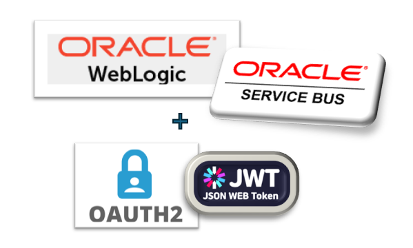
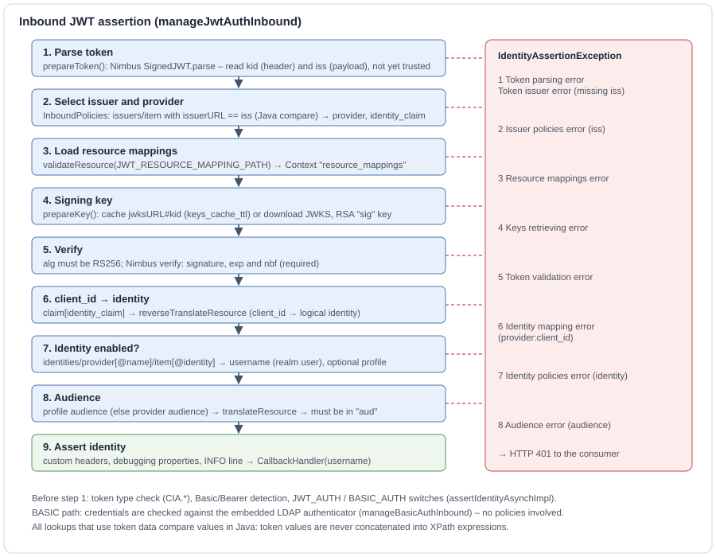
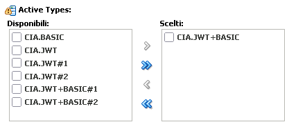
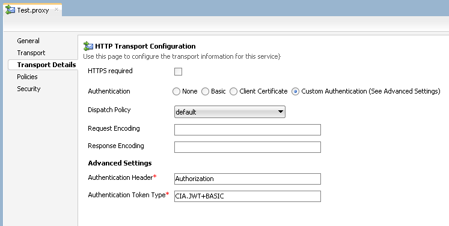
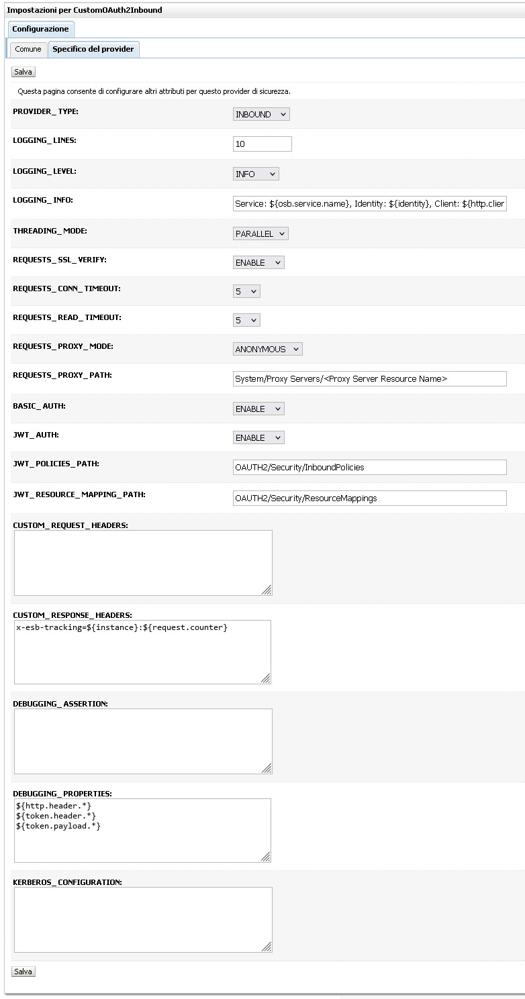

<p align="center"></p>
<div id="user-content-toc" align="center"><ul><summary><h1 align="center">Custom Inbound Authenticator<br/>OAUTH2/JWT and Basic authentication<br/>for OSB Proxy Services</h1></summary></ul></div>

<p align="center"><a href="README.md">README</a> · <b>Inbound</b> · <a href="OUTBOUND.md">Outbound</a> · <a href="doc/CustomAuthenticators-Guide.html">Guide</a> · <a href="doc/CustomAuthenticators-Issues.html">Issues</a></p>

## Overview
<p align="justify">The <code>CustomInboundAuthenticator</code> (CIA) is a WebLogic Custom Identity Assertion Provider that secures OSB Proxy Services with OAUTH2 bearer tokens (signed JWT) and, optionally, with the legacy Basic Auth on the same Proxy Service.<br/><br/>
For each request the provider verifies the token against the trusted issuers declared in <code>InboundPolicies.xml</code>, translates the client_id of the token into a logical identity through <code>ResourceMappings.xml</code>, checks that the identity is enabled and that the token was issued for the expected audience, and finally asserts the WebLogic realm user associated with the identity. From that moment on the pipeline runs as an ordinary realm user, so groups, roles and access policies of the Proxy Services keep working as with Basic Auth.<br/><br/>
Several IDPs can be trusted at the same time by the same provider instance: each issuer is bound to an IDP with its own signing keys, audience and identities.</p>

<p align="center"></p>

## Token Types
<p align="justify">Installing the provider registers in the system the presence of new types of "Tokens" that can be used to secure the Proxy Services. In WebLogic Identity Asserter terminology, Token Types are a declarative way to show which authentication schemes a given provider supports and which are active at a given time, i.e. which can be selected for authentication of a Proxy Service. The provider supports the JWT and BASIC schemes and allows to select them individually or in a combined way through the "JWT+BASIC" type.<br/><br/>
The "JWT+BASIC" typology is useful because on a given Proxy Service it is possible to select only one type of token at a time and the combined token allows to keep both authentication schemes active at the same time on a single Proxy Service. This allows to implement a progressive migration of consumers from the BASIC scheme to the JWT scheme, without having to create different Proxy Services for each scheme.<br/><br/>
As you can see from the image below the provider offers similar types but with a different suffix (#1 and #2). This makes it possible to create multiple instances of the same provider and differentiate their configuration, for example to use different policy files.</p>

<p align="center"></p>

Token Type          | Accepted schemes
------------------- | ------------------------------------------
`CIA.BASIC`         | Basic only.
`CIA.JWT`           | JWT only.
`CIA.JWT+BASIC`     | Both; the scheme is detected from the header value.
`CIA.*#1`, `CIA.*#2`| Same as above, to be activated on additional provider instances.

## How to configure Proxy Services
<p align="justify">To enable the use of the provider on Proxy Services, you need to act from the JDeveloper IDE or from the Service Bus console on the configuration of the Proxy transport details as shown in the following screenshot.<br/><br/>
In the "Authentication Header" field the http header must be specified, whose presence activates the use of the custom authentication provider. It can be any valid identifier, however if you want to support the BASIC authentication scheme together with the JWT scheme, the header must necessarily be the standard "Authorization".<br/><br/>
In the "Authentication Token Type" field you need to select one of the token types selected as active in the Provider configuration.</p>

<p align="center"></p>

<p align="justify">The value of the header is inspected as follows: a value starting with <code>Basic&nbsp;</code> is handled as Basic authentication; anything else is handled as a JWT, with an optional <code>Bearer&nbsp;</code> prefix removed. The detected scheme must be part of the selected token type and enabled by the BASIC_AUTH / JWT_AUTH parameters. When the assertion fails the consumer receives an HTTP 401 and the reason is written in the provider log.</p>

## Provider Parameters
<p align="justify">Below is a detailed description of each parameter. The parameters shared with the outbound provider are described in more detail in the <a href="README.md#provider-parameters">README</a>.</p>

Parameter                     | Default   | Description
----------------------------- | --------- | ---------------------------------------------------------------
`PROVIDER_TYPE`               | INBOUND   | Fixed provider type.
`LOGGING_LINES`               | 10        | Maximum number of stacktrace lines logged.
`LOGGING_LEVEL`               | INFO      | Minimum level of log messages printed.
`LOGGING_INFO`                | (\*\*)    | Format of the logging line generated with the INFO level at the end of each request. Add `${username}` to log the asserted realm user too.
`THREADING_MODE`              | PARALLEL  | Multithreading strategy.
`REQUESTS_SSL_VERIFY`         | ENABLE    | SSL enforcement for the download of the signing keys. Use DISABLE only in non-production environments: with DISABLE a forged key set could be accepted.
`REQUESTS_CONN_TIMEOUT`       | 5         | Connection timeout for the download of the signing keys (Seconds).
`REQUESTS_READ_TIMEOUT`       | 5         | Response timeout for the download of the signing keys (Seconds).
`REQUESTS_PROXY_MODE`         | DIRECT    | Proxy mediation for the download of the signing keys: DIRECT (no proxy), ANONYMOUS, BASIC, NTLM, KERBEROS (NEGOTIATE).
`REQUESTS_PROXY_PATH`         |           | OSB resource path (\*) of the "Proxy Server" used to extract proxy host and credentials.
`BASIC_AUTH`                  | DISABLE   | Allows Basic authentication if it is among those actives in the selected token type.
`JWT_AUTH`                    | DISABLE   | Allows JWT authentication if it is among those actives in the selected token type.
`JWT_POLICIES_PATH`           |           | OSB resource path (\*) of the XML inbound policies (see below). Mandatory.
`JWT_RESOURCE_MAPPING_PATH`   |           | OSB resource path (\*) of the XML resource mappings. Mandatory.
`CUSTOM_REQUEST_HEADERS`      |           | Allows you to inject one or more custom http request headers that will pass through the OSB context. Each line must follow the format \<header\>=\<value\>.
`CUSTOM_RESPONSE_HEADERS`     |           | Allows you to inject one or more custom http response headers that will return to client. Each line must follow the format \<header\>=\<value\>.
`DEBUGGING_ASSERTION`         |           | May contain a javascript text that is used to filter log messages with TRACE or DEBUG level according to arbitrary criteria defined by the user. If present, it must return a Boolean object.
`DEBUGGING_PROPERTIES`        |           | Allows you to send one or more string expressions to the log file. They are printed as log messages with DEBUG level.
`KERBEROS_CONFIGURATION`      |           | Content of the krb5.conf file used for KERBEROS proxy authentication.

(\*) OSB resources path are constructed as follows: `<project-name>/<root-folder>/.../<parent-folder>/<resource-name>`. Template variables are allowed.<br/>
(\*\*) `Service: ${osb.service.name}, Identity: ${identity}, Client: ${http.client.host} (${http.client.addr})`<br/>

<p align="justify">The standard identity asserter attributes "Active Types" and "Base64 Decoding Required" are in the "Common" tab; leave "Base64 Decoding Required" unchecked. Below is a screenshot of the available parameters populated with sample values.</p>

<p align="center"></p>

## Inbound Policies
<p align="justify">The XML resource referenced by <code>JWT_POLICIES_PATH</code> declares which tokens are trusted and which identities are enabled. It is validated against <code>InboundPolicies.xsd</code>.</p>

```xml
<inboundPolicies xsi:noNamespaceSchemaLocation="../Schemas/InboundPolicies.xsd" ...>

   <!-- SAMPLE: replace 00000000-0000-0000-0000-000000000000 with your tenant id and the keycloak.example.com URLs with your realm -->

   <providers>
      <item name="azure"    audience="esb-api"          jwksURL="https://login.microsoftonline.com/common/discovery/keys" keys_cache_ttl="3600" />
      <item name="keycloak" audience="esb-api-keycloak" jwksURL="https://keycloak.example.com/realms/example-realm/protocol/openid-connect/certs" keys_cache_ttl="3600" />
   </providers>

   <issuers>
      <!-- Entra ID token v1 (client in appid) and v2 (client in azp) -->
      <item provider="azure"    identity_claim="appid" issuerURL="https://sts.windows.net/00000000-0000-0000-0000-000000000000/" />
      <item provider="azure"    identity_claim="azp"   issuerURL="https://login.microsoftonline.com/00000000-0000-0000-0000-000000000000/v2.0" />
      <item provider="keycloak" identity_claim="azp"   issuerURL="https://keycloak.example.com/realms/example-realm" />
   </issuers>

   <profiles>
      <item name="alt-audience" audience="other-api" />
   </profiles>

   <identities>
      <provider name="azure">
         <item identity="consumer-a" username="consumer_a" profile="alt-audience" />
         <item identity="consumer-b" username="consumer_b" />
      </provider>
      <provider name="keycloak">
         <item identity="consumer-c" username="consumer_c" />
      </provider>
   </identities>

</inboundPolicies>
```

<p align="justify">The names in the example are fictitious: provider and logical names are free text and only need to be consistent with ResourceMappings and the other resources (see the <a href="README.md#resource-mappings">README</a>). The complete file, together with all the resources it refers to, is in the sample project: <a href="osb/OAUTH2/Security/InboundPolicies.xml"><code>osb/OAUTH2/Security/InboundPolicies.xml</code></a>.</p>

Element / attribute                        | Meaning
------------------------------------------ | ------------------------------------------------------------------------------------
`providers/item/@name`                     | Logical name of the IDP. Must exist as provider in ResourceMappings.
`providers/item/@jwksURL`                  | URL of the JSON Web Key Set used to verify the token signatures.
`providers/item/@keys_cache_ttl`           | Seconds (0-3600) a downloaded signing key stays in memory. 0 disables the cache: one download per request.
`providers/item/@audience`                 | Logical name (resolved through ResourceMappings) of the audience expected in the tokens of identities without profile.
`issuers/item/@issuerURL`                  | Exact value of the `iss` claim accepted. Unique in the file.
`issuers/item/@provider`                   | IDP of the issuer.
`issuers/item/@identity_claim`             | Claim that carries the client_id: `appid` for Entra ID v1 tokens, `azp` for v2 tokens, `azp` or `client_id` for Keycloak.
`profiles/item/@name`, `@audience`         | Named audience that replaces the IDP audience for the identities that reference it.
`identities/provider/@name`                | IDP of the identities below (one block per IDP).
`identities/provider/item/@identity`       | Logical name of the consumer; its value in ResourceMappings is the client_id. Unique per IDP.
`identities/provider/item/@username`       | WebLogic realm user asserted for that consumer. Must exist in the realm.
`identities/provider/item/@profile`        | Optional profile.

<p align="justify">The schema enforces unique IDP names, issuer URLs and profile names, a single identities block per IDP, unique identities per IDP and the existence of the referenced IDPs and profiles.</p>

## Identity model
<p align="justify">The previous project <a href="https://github.com/falpi/osb-jwt-provider">osb-jwt-provider</a> offered several identity mapping strategies (direct identity, claim identity, mapped identity through a "Service Account", combined identity through a validation script). This project adopts a single, explicit model that combines the strengths of those strategies (the identity asserter of osb-jwt-provider is still included in the package, unchanged, to ease the migration: see <a href="LEGACY.md">LEGACY.md</a>):</p>

1. **The IDP proves who the client is**: the client_id is taken from the claim declared for the issuer (`appid`, `azp`, ...), only after the signature has been verified.
2. **The OSB decides who the client is for WebLogic**: the client_id is reverse-translated into a readable logical name (e.g. `consumer-a`) through ResourceMappings, and the logical name is translated into a realm user (e.g. `consumer_a`) by the identities of the policies. The realm user can be an existing Basic Auth user, so consumers can migrate to JWT without re-profiling.
3. **Only enabled identities are accepted**: a client_id known in ResourceMappings but not listed in the identities of its IDP (for example an identity used by the ESB toward producers) is rejected.
4. **Tokens must be issued for the ESB**: the audience of the identity profile (or of the IDP) is translated through ResourceMappings and must be contained in the `aud` claim. This prevents a token obtained by the consumer for another API from being reused on the OSB.

## Processing flow
1. **Parse**: the compact JWT is parsed; a token without `iss` is rejected immediately.
2. **Issuer**: the issuer item matching `iss` gives the IDP and the identity claim; the IDP item gives JWKS URL, key cache and audience.
3. **Mappings**: ResourceMappings is loaded.
4. **Key**: the signing key identified by the `kid` header is taken from cache, or the key set is downloaded and only the requested key (RSA, usage signature) is kept.
5. **Verify**: the `alg` header must be `RS256`; signature, `exp` and `nbf` are verified (60 seconds of clock skew).
6. **Identity**: the client_id is read from the identity claim and reverse-translated into the logical identity.
7. **Enabled identity**: the identity must be listed for the IDP; the item gives username and profile.
8. **Audience**: the expected audience must be equal to `aud` or contained in it.
9. **Assert**: custom headers and debugging properties are processed, the INFO line is logged and the username is returned to WebLogic.

<p align="justify">With Entra ID, v1 tokens carry <code>iss=https://sts.windows.net/&lt;tenant&gt;/</code> and the client in <code>appid</code>; v2 tokens carry <code>iss=https://login.microsoftonline.com/&lt;tenant&gt;/v2.0</code> and the client in <code>azp</code>. Configure one issuer for each version you accept. The value of <code>aud</code> is the resource as requested by the client (GUID or Application ID URI): the mapped audience must contain exactly that form.</p>

#### Basic authentication
<p align="justify">With a token type that includes BASIC and <code>BASIC_AUTH=ENABLE</code>, the credentials are checked against the WebLogic embedded LDAP authenticator and the authenticated user is asserted. Inbound policies and mappings are not used. Users defined only in other authenticators (external LDAP, Active Directory) cannot log in through this path.</p>

## Template Variables
<p align="justify">In addition to the common variables listed in the <a href="README.md#template-variables">README</a>, the following variables are available in the inbound provider.</p>

Variable                      | Replaced by
----------------------------- | ------------------------------------------------------------------------------------
`${authtype}`                 | Authentication detected (BASIC or JWT).
`${client_id}`                | Client id read from the token.
`${identity}`                 | Logical identity of the client (Basic Auth: the user name typed by the consumer).
`${username}`                 | Asserted realm user name.
`${provider}`                 | IDP selected by the issuer.
`${profile}`                  | Profile of the identity (empty if none).
`${audience}`                 | Logical name of the expected audience.
`${identity_claim}`, `${jwks_url}`, `${keys_cache_ttl}` | Values selected from the policies.
`${http.client.host}`         | The remote/client hostname of the http request.
`${http.client.addr}`         | The remote/client address of the http request.
`${http.server.host}`         | The local/server hostname of the machine that took charge of the request.
`${http.server.addr}`         | The local/server address of the machine that took charge of the request.
`${http.server.name}`         | The hostname declared in the http request by the client.
`${http.server.port}`         | The local/server port of the http request.
`${http.content.type}`        | The content mime/type declared in http request by the client.
`${http.content.length}`      | The content length of body.
`${http.content.body}`        | The body sent in http request by the client. Reading it consumes the request stream: use it only for diagnostics, the Proxy Service would receive an empty body.
`${http.request.url}`         | The original url of http request.
`${http.request.proto}`       | The protocol version of http request.
`${http.request.scheme}`      | The scheme of http request.
`${http.header.<name>}`       | The value of the http header \<name\> in the http request.
`${http.header.*}`            | Enumerate all http headers of the request, except "Authorization" to avoid disclosing credentials.

## Log Management
<p align="justify">Below is an example of the logs generated by a JWT authenticated request against Azure Entra ID, with the DEBUG level and an example of using the "DEBUGGING_PROPERTIES" to inspect the JWT token attributes.</p>

```log
... <DEBUG> ##########################################################################################
... <DEBUG> INBOUND AUTH
... <DEBUG> ##########################################################################################
... <DEBUG> ==========================================================================================
... <DEBUG> CONFIGURATION
... <DEBUG> ==========================================================================================
... <DEBUG> PROVIDER_TYPE ................: INBOUND
... <DEBUG> LOGGING_LINES ................: 10
... <DEBUG> LOGGING_LEVEL ................: DEBUG
... <DEBUG> LOGGING_INFO .................: Service: ${osb.service.name}, Identity: ${identity}, Client: ${http.client.host} (${http.client.addr})
... <DEBUG> THREADING_MODE ...............: PARALLEL
... <DEBUG> REQUESTS_PROXY_MODE ..........: ANONYMOUS
... <DEBUG> REQUESTS_PROXY_PATH ..........: System/Proxy Servers/PROXY_Default
... <DEBUG> REQUESTS_SSL_VERIFY ..........: ENABLE
... <DEBUG> REQUESTS_CONN_TIMEOUT ........: 5
... <DEBUG> REQUESTS_READ_TIMEOUT ........: 5
... <DEBUG> BASIC_AUTH ...................: ENABLE
... <DEBUG> JWT_AUTH .....................: ENABLE
... <DEBUG> JWT_POLICIES_PATH ............: OAUTH2/Security/InboundPolicies
... <DEBUG> JWT_RESOURCE_MAPPING_PATH ....: OAUTH2/Security/ResourceMappings
... <DEBUG> CUSTOM_REQUEST_HEADERS .......: 
... <DEBUG> CUSTOM_RESPONSE_HEADERS ......: custom-tracking=${instance}:${wls.managed}:${request.counter}
... <DEBUG> DEBUGGING_ASSERTION ..........: 
... <DEBUG> DEBUGGING_PROPERTIES .........: ${token.payload.*}
... <DEBUG> ==========================================================================================
... <DEBUG> CONTEXT
... <DEBUG> ==========================================================================================
... <DEBUG> Managed Name .................: DefaultServer
... <DEBUG> Project Name .................: ProjectA
... <DEBUG> Service Name .................: PS_Orders_1.0
... <DEBUG> ------------------------------------------------------------------------------------------
... <DEBUG> Server Host ..................: osb-host.local
... <DEBUG> Server Addr ..................: 127.0.0.1
... <DEBUG> ------------------------------------------------------------------------------------------
... <DEBUG> Client Host ..................: client-host.local
... <DEBUG> Client Addr ..................: 10.0.0.1
... <DEBUG> ------------------------------------------------------------------------------------------
... <DEBUG> Request URL ..................: http://127.0.0.1:7101/ProjectA/Orders
... <DEBUG> Content Type .................: application/xml
... <DEBUG> ------------------------------------------------------------------------------------------
... <DEBUG> Selected Token ...............: CIA.JWT+BASIC
... <DEBUG> Detected Auth ................: JWT
... <DEBUG> ==========================================================================================
... <DEBUG> JWT AUTH
... <DEBUG> ==========================================================================================
... <DEBUG> Token Issuer .................: https://sts.windows.net/<tenant_id>/
... <DEBUG> Policies Path ................: OAUTH2/Security/InboundPolicies
... <DEBUG> Resource Mapping Path ........: OAUTH2/Security/ResourceMappings
... <DEBUG> Provider .....................: azure
... <DEBUG> Identity Claim ...............: appid
... <DEBUG> ------------------------------------------------------------------------------------------
... <DEBUG> KEYS RETRIEVE
... <DEBUG> ------------------------------------------------------------------------------------------
... <DEBUG> Keys URL .....................: https://login.microsoftonline.com/common/discovery/keys
... <DEBUG> ------------------------------------------------------------------------------------------
... <DEBUG> TOKEN VALIDATION
... <DEBUG> ------------------------------------------------------------------------------------------
... <DEBUG> Key ID .......................: <kid>
... <DEBUG> Validation ...................: true
... <DEBUG> ------------------------------------------------------------------------------------------
... <DEBUG> IDENTITY ASSERTION
... <DEBUG> ------------------------------------------------------------------------------------------
... <DEBUG> Client ID ....................: <client_id>
... <DEBUG> Identity .....................: consumer-a
... <DEBUG> Profile ......................: alt-audience
... <DEBUG> Audience .....................: other-api => api://other-api
... <DEBUG> Realm UserName ...............: consumer_a
... <DEBUG> ==========================================================================================
... <DEBUG> CUSTOM HEADERS
... <DEBUG> ==========================================================================================
... <DEBUG> Response: custom-tracking=CIA:000:DefaultServer:0000003
... <DEBUG> ==========================================================================================
... <DEBUG> DEBUGGING PROPERTIES
... <DEBUG> ==========================================================================================
... <DEBUG> ${token.payload.*} => 
... <DEBUG> ------------------------------------------------------------------------------------------
... <DEBUG> aud ...................: "api://other-api"
... <DEBUG> iss ...................: "https://sts.windows.net/<tenant_id>/"
... <DEBUG> iat ...................: 1743975300
... <DEBUG> nbf ...................: 1743975300
... <DEBUG> exp ...................: 1743979200
... <DEBUG> appid .................: "<client_id>"
... <DEBUG> appidacr ..............: "1"
... <DEBUG> idtyp .................: "app"
... <DEBUG> sub ...................: "<omissis>"
... <DEBUG> tid ...................: "<omissis>"
... <DEBUG> ver ...................: "1.0"
... <DEBUG> ------------------------------------------------------------------------------------------
... <DEBUG> ##########################################################################################
... <INFO>  Inbound (JWT) => Service: PS_Orders_1.0, Identity: consumer-a, Client: client-host.local (10.0.0.1)
```

## Error messages
<p align="justify">The consumer always receives an HTTP 401; the provider logs one of the following reasons at ERROR level.</p>

Message                                        | Cause
---------------------------------------------- | ------------------------------------------------------------------
Configuration error (mandatory parameter ...)  | Empty mandatory parameter.
Token preparation error                        | Unknown token type, scheme not allowed by the token type or disabled by BASIC_AUTH / JWT_AUTH.
Basic auth error                               | Malformed Basic header or wrong credentials.
Token parsing error                            | Not a valid signed JWT.
Token issuer error                             | Missing `iss` claim.
Issuer policies error (iss)                    | Policies not loadable or issuer not configured.
Resource mappings error                        | ResourceMappings not loadable.
Keys retrieving error                          | Key set download failed, `kid` not found or not an RSA signature key.
Token validation error                         | Algorithm other than RS256, bad signature, token expired or not yet valid.
Identity mapping error (provider:client_id)    | Identity claim missing or client_id not in ResourceMappings.
Identity policies error (identity)             | Client mapped but not enabled in the identities of the IDP.
Audience error (audience)                      | Audience not mapped or not present in `aud`.
