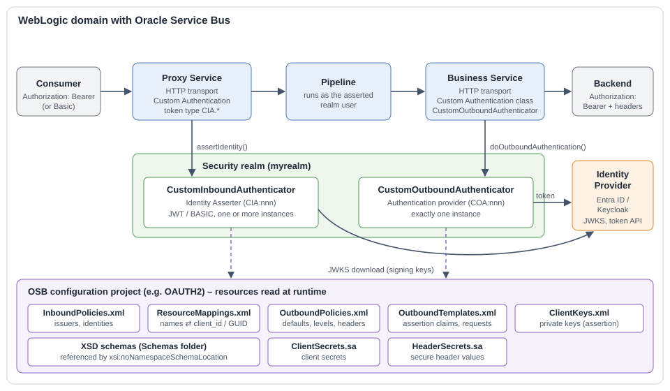
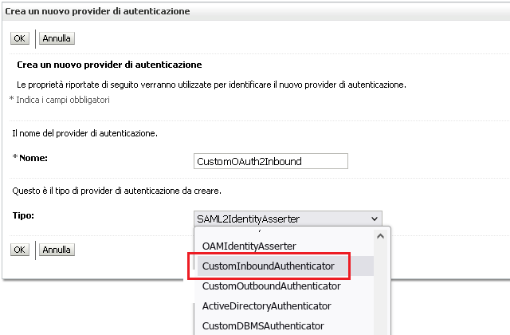
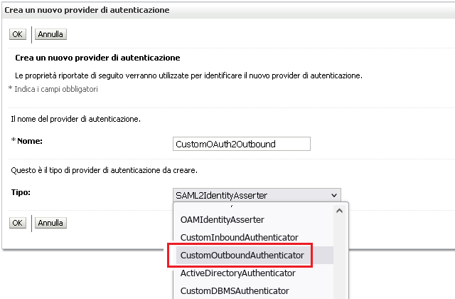
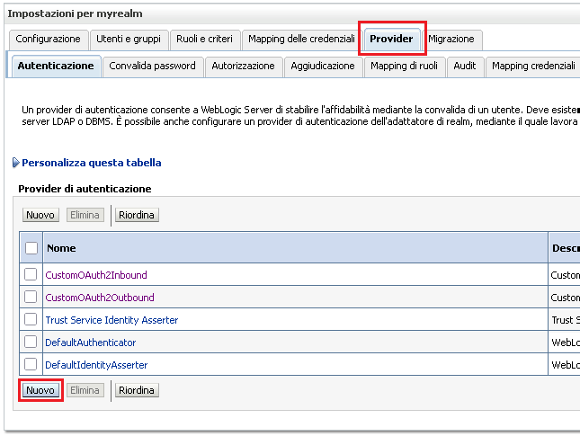
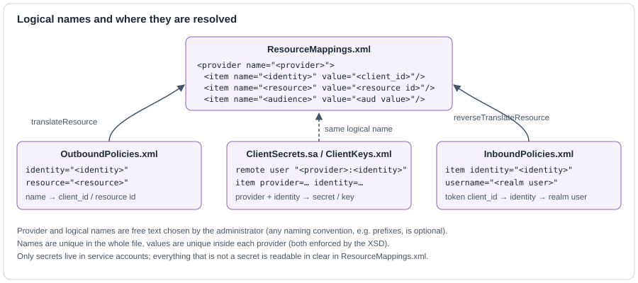

<p align="center"></p>
<div id="user-content-toc" align="center"><ul><summary><h1 align="center">WebLogic Custom Security Providers<br/>for OAUTH2/JWT authentication<br/>on Oracle Service Bus</h1></summary></ul></div>

## Overview
<p align="justify">Up to and including version 12.1.3 the Oracle Service Bus does not support OAUTH2/JWT inbound and outbound authentication out of the box. Starting with version 12.2.1, the OSB supports it through the use of OWSM policies but without the certification and flexibility needed to use third-party IDPs such as Azure Entra ID or Keycloak.<br/><br/>
Furthermore, the use of OWSM policies may not be a proper solution for those who are used to managing authentication and authorization through the simple management of users and groups of the integrated authentication provider of WebLogic. As if that wasn't enough, OAUTH2 introduces the need to adopt identities defined by very long and opaque strings (client_id), that are difficult to re-associate to a given consumer or producer without appropriate mapping mechanisms, and in this OWSM is of no help.<br/><br/>
Fortunately, since the old versions of WebLogic there is the possibility to extend the product with custom security providers. This project brings to the OSB a complete OAUTH2 implementation made of two providers that share the same code base, the same configuration model and the same OSB configuration project:</p>

Provider                          | WebLogic type                                  | Direction                    | Purpose
--------------------------------- | ---------------------------------------------- | ---------------------------- | -----------------------------------------------------------------
`CustomInboundAuthenticator` (CIA)  | Identity Asserter                              | Consumer → Proxy Service     | Validates the JWT bearer token (or the Basic credentials) presented to a Proxy Service and asserts the corresponding WebLogic realm user.
`CustomOutboundAuthenticator` (COA) | Authentication Provider + OSB outbound authentication class | Business Service → Backend | Obtains an access token from the IDP (client credentials with client secret or signed client assertion), caches it and sets `Authorization: Bearer` and optional custom or secret headers on the outgoing request.

<p align="justify">The inbound provider still supports the legacy Basic Auth, to allow the progressive adoption of JWT authentication by different consumers on the same Proxy Service, and maps the opaque client_ids of the tokens to ordinary WebLogic users, so the existing users, groups and access policies keep working. The outbound provider frees Business Services from any OAUTH2 logic: the pipeline does not need to request, cache or inject tokens.<br/><br/>
Both providers can work with several IDPs at the same time: issuers, signing keys, token endpoints and credentials are declared per IDP in XML policies, not in the provider instance. This is why the provider instances in the examples are named <code>CustomOAuth2Inbound</code> and <code>CustomOAuth2Outbound</code>.<br/><br/>
The code base is cross-compiled for Oracle Service Bus 12.2.1.4 (JDK 8) and 14.1.2 (JDK 17) and has been tested with Azure Entra ID (token API v1 and v2) and Keycloak as IDPs. Oracle Service Bus 12.1.3 is not supported: installations still on 12.1.3 can keep using release 1.1.0 of osb-jwt-provider.</p>

## Project history
<p align="justify">This project, <b>osb-jwt-providers</b> (<a href="https://github.com/falpi/osb-jwt-providers">https://github.com/falpi/osb-jwt-providers</a>), is the evolution of the earlier project <b>osb-jwt-provider</b> (<a href="https://github.com/falpi/osb-jwt-provider">https://github.com/falpi/osb-jwt-provider</a>), which offered only the inbound side: a single Custom Identity Asserter configured through MBean attributes. It extends that work with the outbound provider and with a new, policy-based configuration model shared by both providers. Since the differences are radical (configuration model, MBean attributes, package name), the sources are published in a new repository and the release numbering starts again from <b>1.0</b>. From now on the package and each provider have their own version (see <a href="#versioning">Versioning</a>). Installations of the old project must be migrated as described in <a href="#migrating-from-osb-jwt-provider">Migrating from osb-jwt-provider</a>.</p>

<p align="justify">To make that migration easier, the package also contains the <b>legacy inbound provider</b> of osb-jwt-provider, <code>CustomIdentityAsserter</code> (release 1.2.0), adapted to the same osb-commons library as the new providers and integrated in the same jar. Its MBean type, attributes and behaviour are those of osb-jwt-provider 1.2, so an existing realm keeps working when the old jar is replaced by this package, and the Proxy Services can be moved to the new inbound provider one at a time. The legacy provider is not developed further: it is documented, as it was, in <a href="LEGACY.md">LEGACY.md</a> (the README of osb-jwt-provider 1.2).</p>

<p align="center"></p>

## What's new compared with osb-jwt-provider
<p align="justify">This project replaces the configuration model of osb-jwt-provider, based on a large set of MBean attributes, with <b>declarative XML policies</b> stored as OSB resources. The MBeans keep only technical settings (logging, HTTP client, debugging) and the paths of those resources, which are deployed, versioned and promoted like any other OSB artefact and can be changed without restarting the server.</p>

- **New outbound provider** (`CustomOutboundAuthenticator`): OAUTH2 client credentials flow with client secret or signed client assertion, policies per endpoint/project/profile, request and assertion templates, access token cache, custom and secret headers, detection of the OSB operation. See [OUTBOUND.md](OUTBOUND.md).
- **Inbound policies** (`InboundPolicies.xml`): trusted issuers, IDPs (JWKS URL, key cache, audience), profiles and enabled identities. The `JWT_KEYS_*`, `JWT_IDENTITY_*`, `JWT_IDENTITY_ASSERTION` and `VALIDATION_ASSERTION` attributes are gone. See [INBOUND.md](INBOUND.md).
- **Stricter inbound validation**: issuer, signature algorithm pinned to RS256, expiry, enabled identity and audience are always checked.
- **Resource mappings** (`ResourceMappings.xml`): all client_ids and resource GUIDs are addressed by logical names of your choice shared by inbound and outbound; only secrets stay in OSB service accounts.
- **Schema validation**: every XML resource is validated against the XSD it declares, with caching of the positive outcome; errors are logged but do not block the resource (see <a href="#xml-validation">XML validation</a>).
- **Common HTTP settings** (`REQUESTS_*`) for proxy, TLS and timeouts of every call to the IDP.
- **Encryption helper**: passwords of private keys can be stored encrypted with the WebLogic domain key.
- **Readable faults**: the `error_description` returned by the IDP is reported in the OSB fault.
- **Ordered console**: the provider attributes are shown in the console in a logical order instead of alphabetically, thanks to a customization of the MBeanMaker code generation templates (see <a href="#design-notes">Design notes</a>).

## Design notes

#### Why the outbound provider is a WebLogic security provider
<p align="justify">WebLogic security providers are normally used to implement inbound security mechanisms (authentication, identity assertion, authorization). The outbound provider uses the same infrastructure for a different purpose. For Business Services with <i>Custom Authentication</i> the OSB HTTP transport only needs a class that implements <code>OutboundAuthentication</code>: OSB instantiates it by name and offers no way to configure it. Instead of building a configuration mechanism of its own, the same class is also registered as a WebLogic authentication provider (<code>AuthenticationProviderV2</code>) with its own MBean definition, and in this way it gets the standard capabilities of WebLogic and of its console for free:</p>

- typed attributes with defaults, legal values and descriptions, edited in the WebLogic console (tab "Provider Specific") and also available through WLST and JMX;
- persistence in <code>config.xml</code> under the domain change management (Lock &amp; Edit, Activate), the same configuration for all the servers of the domain, and dynamic attributes read again at every request;
- a lifecycle managed by the server (initialization at boot, shutdown) and access to the services of the realm and of the domain, such as the domain encryption used by <code>ENCRYPTION_HELPER</code>;
- a single instance per server that holds the caches (access tokens, signing keys, OSB resources) shared by the instances that OSB creates for each Business Service.

<p align="justify">The provider is never called for inbound security: it returns no login module, no assertion module, no identity asserter and no principal validator, so its position in the realm and its control flag are irrelevant. The instances created by OSB for each Business Service borrow parameters and caches from the realm instance, which is why exactly one outbound provider is allowed in the realm.</p>

#### Console attributes in definition order
<p align="justify">WebLogic MBeanMaker generates for each provider a BeanInfo class that returns the attributes in alphabetical order, so the console normally lists the parameters alphabetically, whatever their order in the MBean definition file. This project, since its first versions, changes that behaviour at build time: MBeanMaker produces the BeanInfo classes from internal code generation templates, and the build injects a modified version of the template so that the generated classes return the attributes in the order of the definition file. The parameters are therefore shown grouped by topic (logging, HTTP requests, policies, headers, debugging) instead of alphabetically. The mechanism is not documented by Oracle and required the reverse engineering of the MBeanMaker templating; the details are in the developer guide (build pipeline).</p>

## Documentation set
Document | Content
-------- | -------
[README.md](README.md) | This file: overview, installation, common configuration, build, logging.
[INBOUND.md](INBOUND.md) | Inbound provider: token types, Proxy Service configuration, parameters, inbound policies, identity model, processing flow, logs.
[OUTBOUND.md](OUTBOUND.md) | Outbound provider: Business Service configuration, parameters, outbound policies, templates, keys and secrets, processing flow, logs.
[LEGACY.md](LEGACY.md) | Legacy inbound provider `CustomIdentityAsserter` of osb-jwt-provider, included in the package for the migration: the original README of release 1.2, unchanged.
[CustomAuthenticators-Guide.html](doc/CustomAuthenticators-Guide.html) | Complete user, developer and reference guide (classes, methods, build pipeline, error reference, troubleshooting).
[CustomAuthenticators-Issues.html](doc/CustomAuthenticators-Issues.html) | Open weaknesses, vulnerabilities and improvements, with file and line references.
[osb/OAUTH2](osb/OAUTH2) | Sample OSB configuration project with all the resources, fictitious values only.

## Installation
<p align="justify">For in-depth information on Custom Providers, please refer to the product documentation (see references). In short, first you need to stop WebLogic and copy the provider package into the folder:</p>

```<WEBLOGIC_HOME>/wlserver/server/lib/mbeantypes```

<p align="justify">The build produces a single jar, <code>osb-jwt-providers-1.0.0.jar</code>, that contains the two providers, the legacy provider <code>CustomIdentityAsserter</code> (see <a href="#project-history">Project history</a>) and, by default (<code>mergeLibraries=true</code>), also the osb-commons library with its third-party libraries: it is the only file to copy, on every machine of the domain in a server installation.<br/><br/>If you prefer to keep the library in a file of its own, for example because the same osb-commons jar is shared with other extensions of the domain, build the package with <code>mergeLibraries=false</code> (see <a href="#build-instructions">Build instructions</a>) and copy into the same folder also the osb-commons jar of the same target (<code>osb-commons-&lt;version&gt;-fmw_&lt;target&gt;.jar</code>, the one the build takes from <code>lib</code>).<br/><br/>Keep exactly one copy of every class in the folder. WebLogic loads all the jars of <code>mbeantypes</code> in a single class loader whose search order depends on the file names, not on the jar a class comes from: two copies of the same classes (two osb-commons versions, a merged package plus a separate osb-commons jar, or this package plus the jar of osb-jwt-provider) are resolved unpredictably and can make the realm fail at boot with errors such as <code>NoSuchFieldError</code> or <code>NoSuchMethodError</code>. The <code>deploy</code> target of the build, which installs the package into the WebLogic installation used for development, removes from <code>mbeantypes</code> the previous <code>osb-jwt-providers-*</code> jars, the <code>osb-jwt-provider-*</code> jars of the old project and, when the libraries are merged, the separate <code>osb-commons-*</code> jars; on the servers of the domain the same files must be removed by hand.<br/><br/></p>

#### If the old provider is installed
<p align="justify">If the domain uses osb-jwt-provider (release 1.1.0 or 1.2.0), this package replaces its jar:</p>

1. Stop the servers and remove from <code>mbeantypes</code> the jar <code>osb-jwt-provider-*.jar</code> and the osb-commons jar it used (<code>osb-commons-1.0.0*.jar</code> for release 1.1.0, <code>osb-commons-1.1.0*.jar</code> for release 1.2.0). With the default merged package no separate osb-commons jar must remain; with a separate build keep only the osb-commons jar of the version required by the package. Then copy the new package.
2. Leave the realm as it is: the legacy provider keeps the MBean type <code>CustomIdentityAsserter</code>, so the existing instance and its attributes in <code>config.xml</code> are loaded from the new package without changes, and the Proxy Services keep working with their token types.
3. Coming from release 1.1.0, check before restarting the behaviour changes of release 1.2 described in <a href="LEGACY.md#release-12">LEGACY.md</a>.
4. Create the new providers and migrate the Proxy Services as described in <a href="#migrating-from-osb-jwt-provider">Migrating from osb-jwt-provider</a>.

#### Making the outbound authentication class visible to OSB
<p align="justify">The jars of <code>mbeantypes</code> are loaded by the class loader of the security providers, which OSB does not use: the HTTP transport of a Business Service with <i>Custom Authentication</i> loads the outbound authentication class from the classpath of the server. The Oracle documentation on custom outbound authentication (see references) does not explain how to make the class visible; as indicated by Oracle support, the provider package (and the osb-commons jar, when it is built separately) must be added to the server classpath in the domain script <code>setDomainEnv</code>, in the assignment of <code>POST_CLASSPATH</code> that contains <code>servicebus-common.jar</code>:</p>

```bat
set POST_CLASSPATH=<WEBLOGIC_HOME>\osb\lib\servicebus-common.jar;<WEBLOGIC_HOME>\wlserver\server\lib\mbeantypes\osb-jwt-providers-<packageVersion>.jar;%POST_CLASSPATH%
```

<p align="justify">With a separate build (<code>mergeLibraries=false</code>) list also the osb-commons jar:</p>

```bat
set POST_CLASSPATH=<WEBLOGIC_HOME>\osb\lib\servicebus-common.jar;<WEBLOGIC_HOME>\wlserver\server\lib\mbeantypes\osb-commons-<version>-fmw_<target>.jar;<WEBLOGIC_HOME>\wlserver\server\lib\mbeantypes\osb-jwt-providers-<packageVersion>.jar;%POST_CLASSPATH%
```

- The script is <code>&lt;DOMAIN_HOME&gt;\bin\setDomainEnv.cmd</code> (<code>setDomainEnv.sh</code> on Linux/Unix, same assignment with <code>:</code> as separator); for the domain integrated in JDeveloper it is in <code>%APPDATA%\JDeveloper\system&lt;version&gt;\DefaultDomain\bin</code>.
- Reference the same files copied into <code>mbeantypes</code>, without a second copy elsewhere. The build deploys the package with a stable name (<code>osb-jwt-providers-&lt;packageVersion&gt;.jar</code>), so the entry changes only when the package or the osb-commons version changes; if a dated jar is copied by hand from <code>deploy</code>, use its exact name.
- The step is needed only by the outbound provider: the inbound providers (also the legacy one) are loaded from <code>mbeantypes</code> by WebLogic.
- Apply it on every machine of the domain and restart the servers; for servers not started through the domain scripts, add the same entries to the class path of their server start configuration.

<p align="justify">Once you have restarted WebLogic, as shown in the following screenshots, you just need to create the providers using the "Providers" tab of the Realm settings in the WebLogic Console:</p>

- create a provider of type **CustomInboundAuthenticator** (e.g. named `CustomOAuth2Inbound`) and reorder the providers to move it to the top. More than one inbound instance may exist, each one activating its own token types;
- create a provider of type **CustomOutboundAuthenticator** (e.g. named `CustomOAuth2Outbound`). **Exactly one** instance is allowed in the realm. It takes no part in user logins, so its position and control flag are not relevant.

<p align="center"></p>
<p align="center"></p>
<p align="center"></p>

<p align="justify">Then open each provider, tab "Configuration → Provider Specific", set the parameters described in the specific documents and activate the changes. Most parameters are dynamic: they are read again at every request, so changes take effect without restart (except <code>KERBEROS_CONFIGURATION</code>, read at initialization).</p>

## Migrating from osb-jwt-provider
<p align="justify">The configuration of the old provider is not reused by the new inbound provider: the MBean attributes have changed and are replaced by the XML resources. Since the legacy provider is part of this package (see <a href="#project-history">Project history</a>), the old and the new identity asserter can work side by side with a single jar, and the migration can be done at once or gradually.</p>

#### Switch-off (e.g. test environments)

1. Install the package as described in <a href="#if-the-old-provider-is-installed">If the old provider is installed</a>.
2. In the realm, delete the old identity asserter and create the new providers as described above: the MBean attributes have changed (<code>JWT_KEYS_*</code>, <code>JWT_IDENTITY_*</code>, <code>VALIDATION_ASSERTION</code> no longer exist) and are replaced by the XML resources.
3. Create the configuration project (next section) and move the old settings: JWKS URL and key cache into the inbound providers, the identity mapping service account into ResourceMappings plus the inbound identities, the validation script into issuers and audiences.
4. Proxy Services keep the same token types (<code>CIA.*</code>), so their transport configuration does not change.

#### Gradual migration (e.g. production)

1. Install the package as described in <a href="#if-the-old-provider-is-installed">If the old provider is installed</a>: the old identity asserter keeps working, now loaded from the new package.
2. Create the new providers and the configuration project, giving the two identity asserters different active token types, for example <code>CIA.JWT+BASIC</code> to the old one and <code>CIA.JWT+BASIC#1</code> to the new one.
3. Migrate the Proxy Services one at a time by changing their token type; restoring the previous token type rolls a proxy back, without restarts or realm changes.
4. When the last Proxy Service has moved, delete the old identity asserter from the realm; its classes stay in the package, unused.

## Configuration project
<p align="justify">The policies and the secrets used at runtime are ordinary OSB resources. They can live in any OSB project; the recommended layout is a dedicated project named <code>OAUTH2</code>, organized as follows. Each MBean path parameter points to one of these resources.</p>

Resource (OSB path)                      | OSB type                  | Used by  | Content
---------------------------------------- | ------------------------- | -------- | -------------------------------------------------------------
`OAUTH2/Security/InboundPolicies`        | XML                       | Inbound  | Issuers, IDPs (JWKS, audience, key cache), profiles, enabled identities.
`OAUTH2/Security/OutboundPolicies`       | XML                       | Outbound | Defaults, profiles, project and endpoint policies, custom and secure headers.
`OAUTH2/Security/OutboundTemplates`      | XML                       | Outbound | Token request templates and client assertion templates.
`OAUTH2/Security/ResourceMappings`       | XML                       | Both     | Logical names → client_id / resource / audience values, per IDP.
`OAUTH2/Security/ClientKeys`             | XML                       | Outbound | PEM private keys used to sign client assertions.
`OAUTH2/Security/ClientSecrets`          | Service Account (mapping) | Outbound | Client secrets.
`OAUTH2/Security/HeaderSecrets`          | Service Account (mapping) | Outbound | Values of secure headers; the remote user is the header key, which can be composed with templates (e.g. service name and operation). See [OUTBOUND.md](OUTBOUND.md#client-secrets-and-header-secrets).
`OAUTH2/Schemas/*`                       | XML Schema                | Both     | One XSD for each XML resource.

(*) OSB resources path are constructed as follows: `<project-name>/<root-folder>/.../<parent-folder>/<resource-name>`.<br/>
If a resource is located directly under a project, the path is constructed as follows: `<project-name>/<resource-name>`.<br/>
Please note that resources of type "Proxy Server" can only be created in the fixed path `System/Proxy Servers/<resource-name>`.<br/>
All path parameters accept template variables, e.g. `${osb.project}/Security/HeaderSecrets` to keep secrets per project (exception: outbound `JWT_POLICIES_PATH`, read verbatim).<br/>

<p align="justify">Resources are read through the OSB configuration API and kept in memory; a new version is picked up at the first request after its deployment.</p>

<p align="justify"><b>Sample project.</b> The folder <a href="osb/OAUTH2"><code>osb/OAUTH2</code></a> of this repository contains a complete OSB project with this layout and a consistent sample configuration of every resource (two IDPs, consumers, profiles, project and endpoint policies, templates, client keys, client and header secrets). All names and values are fictitious and the keys and secrets are placeholders: import it into JDeveloper as a starting point and replace the values with those of your installation. The examples shown in these documents are taken from it.</p>

#### XML validation
<p align="justify">Each XML resource must declare its schema in the root element with <code>xsi:noNamespaceSchemaLocation</code>, as a path relative to the resource folder (e.g. <code>../Schemas/InboundPolicies.xsd</code>) or absolute (starting with <code>/</code>). The providers validate the resource with XmlBeans, including all keys and key references declared in the XSD, and remember the positive outcome until the resource or the schema change. Validation errors are logged at ERROR level, one line per error, but the resource is still used, so that a small mistake does not stop the traffic: keep an eye on the logs after each deployment. The same files are validated at design time by JDeveloper.</p>

## Resource Mappings
<p align="justify">OAUTH2 identities are opaque GUIDs. To keep policies readable, every value that is not a secret (client_id of consumers and of the ESB, GUID or URI of target resources, audiences) is declared once in <code>ResourceMappings.xml</code> and referenced elsewhere by a logical name. The file is organized by IDP, so that the same logical name can be resolved by inbound and outbound in the context of the right IDP.</p>

```xml
<resourceMappings xsi:noNamespaceSchemaLocation="../Schemas/ResourceMappings.xsd" ...>
   <provider name="azure">
      <item name="consumer-a"       value="<client_id of consumer A>"/>
      <item name="esb-to-backend-x" value="<client_id used by the ESB toward backend X>"/>
      <item name="esb-api"          value="<Application ID URI or client_id of the ESB API>"/>
      <item name="function-a"       value="<resource id of Function App A>" note="free text"/>
   </provider>
   <provider name="keycloak">
      ...
   </provider>
</resourceMappings>
```

Rule                                                     | Enforced by
-------------------------------------------------------- | -------------------------------------
`provider/@name` is unique                               | XSD key `providerNameKey`
`item/@name` is unique in the whole file                 | XSD key `resourceNameKey`
`item/@value` is unique inside each provider             | XSD key `resourceValueKey` (needed by the inbound reverse lookup)

<p align="justify">The outbound provider translates names into values (identity → client_id, resource → GUID), the inbound provider translates the client_id found in the token back into the logical identity, and the audience name into the expected value. See the note below about the names used in the examples.</p>

> **Note on the examples.** Provider names and logical names are free text chosen by the administrator: the providers only require them to be consistent across the files. All the names used in the examples (identities, users, projects, services, operations) are fictitious; a naming convention, for example prefixes that distinguish app registrations, APIs and Function Apps, can be adopted but is not required.

<p align="center"></p>

## Provider Parameters
<p align="justify">The two providers share a group of parameters for logging, HTTP requests toward the IDP and debugging. The parameters specific to each provider are described in <a href="INBOUND.md">INBOUND.md</a> and <a href="OUTBOUND.md">OUTBOUND.md</a>.</p>

Parameter                     | Description
----------------------------- | ---------------------------------------------------------------
`PROVIDER_TYPE`               | Fixed provider type (INBOUND or OUTBOUND), shown in logs.
`LOGGING_LINES`               | Maximum number of stacktrace lines logged (only with TRACE level).
`LOGGING_LEVEL`               | Minimum level of log messages printed (TRACE, DEBUG, INFO, WARN, ERROR).
`LOGGING_INFO`                | Format of the logging line generated with the INFO level at the end of each request. Supports template variables.
`THREADING_MODE`              | Multithreading strategy (PARALLEL or SERIAL, see below).
`REQUESTS_SSL_VERIFY`         | SSL enforcement for the requests to the IDP (JWKS download, token requests). Use DISABLE only in non-production environments to test endpoints.
`REQUESTS_CONN_TIMEOUT`       | Connection timeout of the requests to the IDP (Seconds, 5 to 30).
`REQUESTS_READ_TIMEOUT`       | Response timeout of the requests to the IDP (Seconds, 5 to 30): maximum wait for data once connected, so that an IDP or proxy that stops answering cannot block the server thread.
`REQUESTS_PROXY_MODE`         | Requests to the IDP require proxy mediation. The following choices are supported: DIRECT (no proxy), ANONYMOUS, BASIC, NTLM, KERBEROS (NEGOTIATE).
`REQUESTS_PROXY_PATH`         | OSB resource path (\*) of the "Proxy Server" used to extract proxy host and credentials. Mandatory unless DIRECT.
`JWT_POLICIES_PATH`           | OSB resource path (\*) of the XML policies of the provider.
`JWT_RESOURCE_MAPPING_PATH`   | OSB resource path (\*) of the XML resource mappings.
`CUSTOM_REQUEST_HEADERS`      | Allows you to inject one or more custom http request headers. Each line must follow the format \<header\>=\<value\>.
`DEBUGGING_ASSERTION`         | May contain a javascript text that is used to filter log messages with TRACE or DEBUG level according to arbitrary criteria defined by the user. This can be useful to reduce log messages and analyze specific requests. If present, it must return a Boolean object.
`DEBUGGING_PROPERTIES`        | Allows you to send one or more string expressions to the log file. They are printed as log messages with DEBUG level. Any template variables are resolved allowing you to analyze the runtime context.
`KERBEROS_CONFIGURATION`      | Content of the krb5.conf file used when the proxy requires KERBEROS authentication. It is written to a temporary file at initialization and set as the Kerberos configuration of the server JVM; leave it empty when Kerberos is not used, so that the Kerberos settings of the server are not touched (the initialization log then shows <code>Kerberos Config: undefined</code>).

## Template Variables
<p align="justify">All string configuration parameters, policies and templates support the use of substitution variables to create configurations that can dynamically adapt to the runtime state. Variable names are dot-separated segments of letters, "_" and "-" (digits are not allowed); a variable that does not exist raises an error. The following variables are available in both providers; the variables specific to each provider are listed in the respective documents.</p>

Variable                      | Replaced by
----------------------------- | ------------------------------------------------------------------------------------
`${uuid}`                     | Random UUID generated for the request.
`${thread}`                   | Current thread id.
`${context}`                  | "inbound" or "outbound".
`${instance}`                 | Unique identifier of the instance. It is "CIA:nnn" or "COA:nnn" where nnn is a hexadecimal counter (at least three digits) of the instances created for the provider, unique within the server.
`${providername}`             | The user-assigned provider instance name (e.g. CustomOAuth2Inbound).
`${request.counter}`          | Request counter for this provider instance on current managed server.
`${request.datetime}`         | Request timestamp in the format yyyy-MM-dd HH:mm:ss.SSS
`${request.timestamp}`        | Request milliseconds since unix epoch.
`${current.datetime}`         | Current timestamp in the format yyyy-MM-dd HH:mm:ss.SSS
`${current.timestamp}`        | Current milliseconds since unix epoch.
`${current.epoch}`            | Current seconds since unix epoch (useful for JWT claims).
`${wls.realm}`                | WebLogic Realm Name.
`${wls.domain}`               | WebLogic Domain Name.
`${wls.managed}`              | WebLogic Managed Server Name.
`${java.version}`             | Java major version.
`${osb.project}`              | The name of the OSB project of the Proxy Service (inbound) or Business Service (outbound).
`${osb.service.name}`         | The name of the Proxy Service (inbound) or Business Service (outbound).
`${osb.service.path}`         | The full path of the Proxy Service (inbound) or Business Service (outbound).
`${token.header.<attr>}`      | The value of the header \<attr\> element in the JWT token (inbound: incoming token, outbound: access token obtained). If token is not initialized return blank.
`${token.header.*}`           | Enumerate all attributes of JWT token header.
`${token.payload.<attr>}`     | The value of the payload \<attr\> element in the JWT token. If token is not initialized return blank.
`${token.payload.*}`          | Enumerate all attributes of JWT token payload.
`${token.serialize}`          | The compact serialization of the JWT token.

## Scripting
<p align="justify">JavaScript expressions are used by <code>DEBUGGING_ASSERTION</code> and by the values of the outbound templates. Template variables are resolved in the script text before the evaluation. The engine is selected at initialization: Nashorn on JDK 8, the Rhino engine bundled in the library on JDK 17. Scripts have full access to Java classes, so only administrators must be able to change them. For example, to restrict debug logs to the requests of a single OSB project:</p>

```javascript
'${osb.project}'=='ProjectA'
```

## Build instructions
<p align="justify">The sources can be compiled with any Java IDE with Ant support but you need to prepare the necessary dependencies for WebLogic and Oracle Service Bus libraries. You only need to modify "javaHomeDir" and "weblogicDir" in "build.xml" file to suit your environment. The file supports the targets WebLogic 12.2.1 and 14.1.2 on a Windows operating system. Here is an excerpt of the section that needs to be customized.</p>

```xml
    <switch value="${targetConfig}">
      <case value="12.2.1">
        ...
        <property name="javaHomeDir" value="C:/Programmi/Java/jdk1.8"/>
        <property name="weblogicDir" value="C:/Oracle/Middleware/12.2.1"/>
        ...
      </case>
      <case value="14.1.2">
        ...
        <property name="javaHomeDir" value="C:/Programmi/Java/jdk17"/>
        <property name="weblogicDir" value="C:/Oracle/Middleware/14.1.2"/>
        ...
      </case>
      <default>
        <fail message="Unsupported target: ${targetConfig}"/>
      </default>
    </switch>
```
Other important configuration options are as follows:
```xml
    <property name="embedSources" value="false"/>
    <property name="mergeLibraries" value="true"/>
```
<p align="justify">The first one checks if you want to include the sources in the deploy package. The second one checks if you want to produce a "fat" (or "merged") jar archive that includes the dependencies; it is <code>true</code> by default.<br/><br/>
All dependencies have been separated from the project and concentrated in the osb-commons library (see credits). The build takes it from the <code>lib</code> folder with the pattern <code>*-fmw_&lt;version&gt;.jar</code>, so the osb-commons jar must be built for the same target and copied there first. By default it is merged into the package, so that a single file is installed (also in <code>POST_CLASSPATH</code>) and no other copy of the library can conflict with it. You can always build with <code>mergeLibraries=false</code> to keep two separate files, for example when the same osb-commons jar is shared with other extensions of the domain: the build does not copy it into <code>mbeantypes</code>, so it is installed once by hand (see <a href="#installation">Installation</a>).</p>

<p align="justify">The build runs WebLogic MBeanMaker on the MBean definition files (the two providers and the legacy provider) and then applies two customizations to the generated code: the BeanInfo classes reorder the attributes following the definition files (the console would otherwise sort them alphabetically; the generator template is patched before MBeanMaker runs, see <a href="#design-notes">Design notes</a>), and the setter of the outbound <code>ENCRYPTION_HELPER</code> attribute encrypts the value with the domain key. The resulting package is named <code>deploy/osb-jwt-providers-1.0.0.&lt;yyyyMMdd&gt;-fmw_&lt;version&gt;.jar</code>; name and version are set by the <code>packageName</code> and <code>packageVersion</code> properties of <code>build.xml</code>, and the manifest of the jar records the package and the provider versions (see <a href="#versioning">Versioning</a>).</p>

<p align="justify">The repository contains two projects already prepared for JDeveloper 12.2.1.4 and 14.1.2 installation on Windows operating system. You could install JDeveloper with respective versions of Oracle SOA Suite Quick Start for Developers (see references). Ant compilation can be triggered from JDeveloper by right-clicking on the "build.xml" file and selecting the "all" target or from the command line by running the "build-xxx.cmd" Windows batch. Note that cross-compilation is supported, meaning that you can compile the provider for a different version target than JDeveloper, provided that the dependency libraries are accessible and configured correctly in the Ant build targets.</p>

At the end of the compilation the jar archive is automatically copied as ```osb-jwt-providers-1.0.0.jar``` into the ```<WEBLOGIC_HOME>/wlserver/server/lib/mbeantypes``` folder from which WebLogic loads the security providers at startup, so you can directly launch the WebLogic environment integrated into JDeveloper to test the providers after build. Before copying it, the build removes from that folder the jars that would duplicate its classes (see <a href="#installation">Installation</a>). The user running the build needs write permission on that folder: if the WebLogic installation grants it only to administrators, the deploy fails with <code>java.nio.file.AccessDeniedException</code>. In that case grant the permission once, from a prompt opened as administrator, for example <code>icacls "&lt;WEBLOGIC_HOME&gt;\wlserver\server\lib\mbeantypes" /grant "&lt;user&gt;:(OI)(CI)M"</code>.

## Versioning
<p align="justify">The project uses two independent levels of versioning, because the two providers have their own development cycles while every release always ships both of them in a single package.</p>

Level | Where it is declared | What it identifies | When to change it
----- | -------------------- | ------------------ | -----------------
Provider | Default of the read-only MBean attribute `Version` in the definition file of the provider (`CustomInboundAuthenticator.xml`, `CustomOutboundAuthenticator.xml`; `CustomIdentityAsserter.xml` for the legacy provider) | The code and the MBean of that provider | When that provider changes; the other provider keeps its version
Package | Property `packageVersion` in `build.xml` | A release of the jar, which always contains both providers and the legacy provider (and, when merged, osb-commons and its libraries) | At every release, also when only libraries or build change

<p align="justify">The package version is deliberately not derived from the versions of the providers (for example as their maximum): two different releases could get the same number, and a release that only updates a library would not change it. A simple rule, in the spirit of semantic versioning, is to raise the <b>major</b> number of the package when a provider changes its major number or the configuration (MBean attributes, XML schemas) changes in an incompatible way, the <b>minor</b> number for new features of a provider or of the package, and the <b>patch</b> number for everything else, including library updates.</p>

<p align="justify">The provider version is shown in the WebLogic console (attribute <code>Version</code> of the provider) and in the <code>Provider Title</code> line of the initialization log. The package version is in the name of the jar (<code>osb-jwt-providers-&lt;packageVersion&gt;.&lt;yyyyMMdd&gt;-fmw_&lt;version&gt;.jar</code> in <code>deploy</code>, <code>osb-jwt-providers-&lt;packageVersion&gt;.jar</code> in <code>mbeantypes</code>) and in its manifest.</p>

#### Package manifest
<p align="justify">The build writes in the manifest of the jar the identification of the package together with the versions of the providers it contains, so that every jar tells exactly what it is, even outside the server. Nothing is declared twice: the provider versions are read by the build from the MBean definition files, and the build stops with <code>MBean version not found</code> if a version is missing or is not numeric (<code>n</code>, <code>n.n</code>, <code>n.n.n</code>, ...).</p>

Attribute | Source | Example
--------- | ------ | -------
`Implementation-Title` | `packageName` in `build.xml` | `osb-jwt-providers`
`Implementation-Version` | `packageVersion` in `build.xml` | `1.0.0`
`Build-Date` | build date (`yyyyMMdd`) | `20261003`
`Build-Target` | target of the build (`fmw_<weblogicVersion>`) | `fmw_12.2.1`
`Legacy-Version` | `Version` of `CustomIdentityAsserter.xml` (legacy provider) | `1.2.0`
`Inbound-Version` | `Version` of `CustomInboundAuthenticator.xml` | `1.0.0`
`Outbound-Version` | `Version` of `CustomOutboundAuthenticator.xml` | `1.0.0`

<p align="justify">The first three lines of the manifest are added by Ant itself (<code>Created-By</code> is the JDK that runs Ant, not the target JDK: the target is given by <code>Build-Target</code>). When libraries are merged (<code>mergeLibraries=true</code>, the default) their manifests are discarded, so the jar always contains only this one. To read it:</p>

```bash
unzip -p osb-jwt-providers-1.0.0.jar META-INF/MANIFEST.MF
```

```
Manifest-Version: 1.0
Ant-Version: Apache Ant 1.10.5
Created-By: 1.8.0_451-b10 (Oracle Corporation)
Implementation-Title: osb-jwt-providers
Implementation-Version: 1.0.0
Build-Date: 20261003
Build-Target: fmw_12.2.1
Legacy-Version: 1.2.0
Inbound-Version: 1.0.0
Outbound-Version: 1.0.0
```

<p align="justify">At startup the inbound and outbound providers read the manifest of the jar they were loaded from and write it in the <code>Package Title</code> line of the initialization log (see <a href="#log-management">Log Management</a>). If the jar has no such attributes, or the jar cannot be located, the line shows <code>unknown</code> and the initialization goes on.</p>

## Log Management
The log messages generated by the providers follow the following format: ```<timestamp> <module> <sequence> <level> <message>```.<br/>
Let's see below the format of each token:

Token              | Format
------------------ | ------------------------------------------------------------------------------------
`<timestamp>`      | Timestamp with milliseconds resolution in the format 'yyyy-MM-dd HH:mm:ss.SSS'.
`<module>`         | Identifies the provider instance that generated the message: 'CIA:nnn' for inbound and 'COA:nnn' for outbound, where 'nnn' is a hexadecimal counter (at least three digits) incremented for each instance, unique within the server also for the outbound instances created by OSB for each Business Service.
`<sequence>`       | Numeric sequence incremented at each request handled by the instance.
`<level>`          | Log message severity level (TRACE, DEBUG, INFO, WARN, ERROR).
`<message>`        | Message text.

<p align="justify">The providers write to the standard output of the server (the <code>.out</code> file), with different levels of attention depending on the type of information. The logging level to filter messages is defined by the LOGGING_LEVEL parameter; a stack trace of at most LOGGING_LINES lines is added to errors only with the TRACE level. Below is the log generated during initialization (WebLogic boot); the logs generated at each request are shown in the specific documents.</p>

```log
... <INFO>  ##########################################################################################
... <INFO>  INITIALIZE
... <INFO>  ##########################################################################################
... <INFO>  Realm Name ............: myrealm
... <INFO>  Domain Name ...........: DefaultDomain
... <INFO>  Managed Name ..........: DefaultServer
... <INFO>  ------------------------------------------------------------------------------------------
... <INFO>  Instance ID ...........: CIA:000
... <INFO>  Provider Type .........: INBOUND
... <INFO>  Provider Name .........: CustomOAuth2Inbound
... <INFO>  Provider Title ........: Custom Inbound Authenticator (1.0.0)
... <INFO>  Package Title .........: osb-jwt-providers 1.0.0 (20261003, fmw_12.2.1, legacy 1.2.0, inbound 1.0.0, outbound 1.0.0)
... <INFO>  ------------------------------------------------------------------------------------------
... <INFO>  JWT Provider ..........: org.falpi.utils.jwt.JWTProviderNimbusShadedImpl
... <INFO>  Kerberos Config .......: C:\Temp\krb5-4823829319811767945.conf
... <INFO>  Scripting Engine ......: Oracle Nashorn (1.8.0_391)
... <INFO>  Scripting Language ....: ECMAScript (ECMA - 262 Edition 5.1)
... <INFO>  ------------------------------------------------------------------------------------------
```

<p align="justify">Please note that at DEBUG level the values of the headers added to requests are logged, and at TRACE level also the token requests and responses of the outbound provider, which contain client secrets, client assertions and access tokens. Do not keep these levels active in production, or restrict them to specific requests with DEBUGGING_ASSERTION.</p>

## Threading Mode
<p align="justify">The provider code base was designed to be thread-safe because Identity Asserters and outbound authentication classes in WebLogic and OSB are called in parallel and this is their normal behavior. If multiple requests arrive at the same time the server allocates a different thread for each request. The state of each request is kept in thread-local objects, removed at the end of every request also when it fails (so that tokens and secrets do not remain on the pooled server threads), while the caches of signing keys and access tokens are shared.<br/><br/>
However there may be situations where it is useful to force serialization of requests and this is the purpose of the "THREADING_MODE" configuration parameter. When "SERIAL" mode is selected a "synchronized" version of the processing method is used and this causes multiple parallel requests to be queued serially, without overlapping.<br/><br/>
This could be useful for example for analyzing debug logs of a specific service in the presence of a large number of requests. In "PARALLEL" mode the log lines of each request/thread would be mixed with those of others. In "SERIAL" mode instead each execution completes atomically with a consistent footprint of its logs.</p>

## Known Issues
#### 1. Invalid signature with Azure Entra ID
```com.nimbusds.jose.proc.BadJWSException: Signed JWT rejected: Invalid signature```
<p align="justify">The providers use the excellent Nimbus library for verifying JWT tokens. Please note that using Azure Entra ID as IDP, access tokens issued for Microsoft Graph carry a "nonce" header and cannot be verified by third parties. Consumers must request tokens for an app registration of the ESB (its client_id or Application ID URI as resource or scope). See the following articles:</p>

- https://stackoverflow.com/questions/71306470/cant-verify-access-token-signature-from-azure-using-nimbus<br/>
- https://stackoverflow.com/questions/75535497/azure-oauth2-cant-validate-access-token<br/>

#### 2. Tokens without "nbf" claim
```JWT missing required claims: [nbf]```
<p align="justify">The verification currently requires both the "exp" and "nbf" claims. Some IDP configurations (e.g. some Keycloak clients) do not issue "nbf".</p>

#### 3. Server fails at boot
<p align="justify">Any initialization error of a provider, as well as the presence of a second outbound provider in the realm, makes the server fail at boot on purpose: the provider throws a <code>ProviderInitializationException</code>, the realm cannot be loaded and WebLogic logs <code>BEA-090870</code> (<i>The realm "myrealm" failed to be loaded</i>) with the reason and the name of the provider, then the server goes to <code>FAILED</code> and shuts itself down (<code>BEA-000383</code>, <i>A critical service failed</i>). The details are also written in the provider log lines of the <code>.out</code> file. Since the Admin Server fails too, a wrong parameter must be corrected without the console, for example in <code>config.xml</code> while the servers are stopped.</p>

<p align="justify">A complete list of the open points is available in <a href="doc/CustomAuthenticators-Issues.html">CustomAuthenticators-Issues.html</a>.</p>

## Credits
- **JSON-java** (https://github.com/stleary/JSON-java)<br/>
- **Mozilla Rhino** (https://github.com/mozilla/rhino)<br/>
- **Apache HttpClient** (https://hc.apache.org/httpcomponents-client-4.5.x/index.html)<br/>
- **Nimbus JOSE + JWT** (https://connect2id.com/products/nimbus-jose-jwt)<br/>
- **Bouncy Castle** (https://www.bouncycastle.org)<br/>
- **OSB Commons** (https://github.com/falpi/osb-commons)<br/>
- **osb-jwt-provider**, the inbound-only project this one derives from (https://github.com/falpi/osb-jwt-provider)<br/>

## References
- WebLogic 12.1.3 Identity Assertion Providers:<br/> https://docs.oracle.com/middleware/1213/wls/DEVSP/ia.htm
- WebLogic 12.1.3 Security Providers Developer Guide:<br/> https://docs.oracle.com/middleware/1213/wls/DEVSP/DEVSP.pdf
- Generate an MBean Type Using the WebLogic MBeanMaker:<br/> https://docs.oracle.com/middleware/1213/wls/DEVSP/generate_mbeantype.htm
- Oracle Service Bus, custom authentication for outbound HTTP (Business Services):<br/> https://docs.oracle.com/middleware/1213/osb/develop/GUID-966DBF19-BFAD-4755-8F5A-D2CD12D9A933.htm#OSBDV89425
- Microsoft identity platform, OAuth 2.0 client credentials flow:<br/> https://learn.microsoft.com/en-us/entra/identity-platform/v2-oauth2-client-creds-grant-flow
- Microsoft identity platform, certificate credentials (client assertion):<br/> https://learn.microsoft.com/en-us/entra/identity-platform/certificate-credentials
- Sample Custom Identity Asserter for Weblogic Server:<br/> https://weblogic-wonders.com/simple-sample-custom-identity-asserter-weblogic-server-12c/
- Sample Custom SSO using Weblogic IdentityAsserter:<br/> https://virtual7.de/en/blog/custom-sso-using-weblogic-identityasserter
